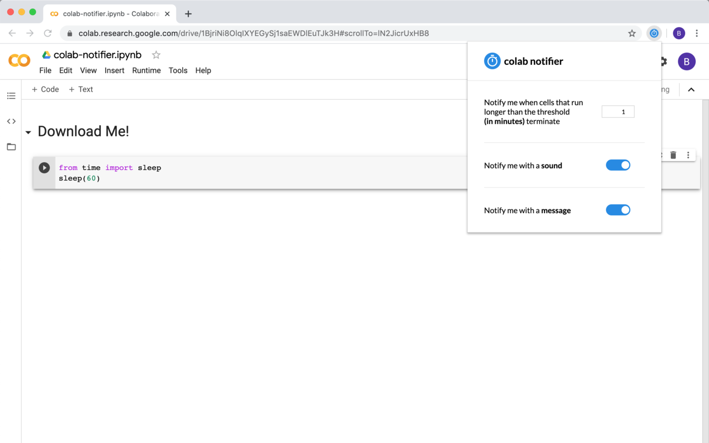

## colab notifier
**colab notifier** is a Google Chrome extension that notifies you when cells are finished running.

## Screenshots

## Description
The days of nervously checking your Google Colaboratory notebook are over. You can now safely enjoy watching YouTube videos while your models are training without having to check whether your notebook has finished running or not. Using **colab notifier** you will get notified when your cells are finished after running longer than a certain threshold set by you. You can get notified with a sound, a message, or both.  

## Installation
colab notifier is published on the Chrome Web Store: https://chrome.google.com/webstore/detail/colab-notifier/njppjhbkfdkokacgoifjbbkijgfpkjec

## Contribute

## License
